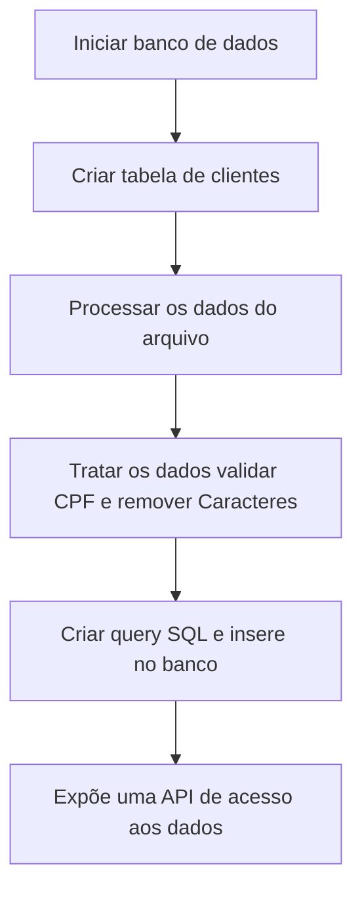

# Processar lista

Script para processar uma lista de clientes e salvar no banco de dados.

O problema foi resolvido de duas formas diferente usando a linguagem **go** e **python** mas mantendo o mesmo fluxo abaixo.

## Fulxo do programa

## Teste escrito em Python
O projeto esta dentro do diretorio **python**

> cd  ./python

o projeto pode ser iniciado com o comando 

    make install
ou 

    docker-compose up

### Outros comandos

para reiniciar o projeto do zero (compilando e sem nada no banco de dados)

    make reset
Acessar o terminal do container da aplicação

    make bash

## Teste escrito em GO

O projeto esta dentro do diretorio **go**

> cd  ./go

o projeto pode ser iniciado com o comando 

    make install
ou 

    docker-compose up

### Outros comandos

para reiniciar o projeto do zero (compilando e sem nada no banco de dados)

    make reset
Acessar o terminal do container da aplicação

    make bash

